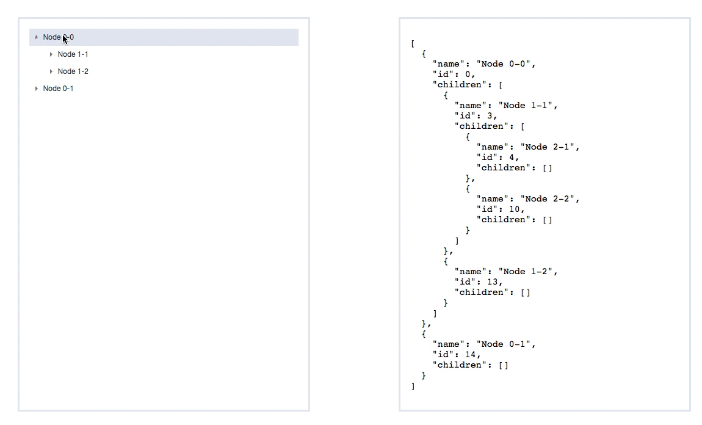

# vue-drag-tree

[](https://www.npmjs.com/package/vue-drag-tree)[](https://www.npmjs.com/package/vue-drag-tree)[](https://opensource.org/licenses/MIT)

> It's a tree components(Vue2.x) that allow you to drag and drop the node to exchange their data .

**Feature**

- **Double click** on an node to turn it into a folder
- **Drag and Drop** the tree node, even between two different levels
- **Customize your node (how to display node. eg: node name and left icon )**
- **Controls** whether a particular node can **be dragged** and whether the node can be plugged into other nodes
- **Append/Remove** Node in any level (#TODO)

**[中文](README_ZH.md)** || **Please Star! if it's helpful**.
**[Example Project](https://github.com/shuiRong/vue-drag-tree-demo)**

### Preview

---



### Getting Start

---

**Install**

`npm install vue-drag-tree --S`

or

`yarn add vue-drag-tree -S`

**Usage**

the following code is come from [here](https://github.com/shuiRong/vue-drag-tree-demo)


**P.S.** If you get error about` Vue packages version mismatch`


```bash
// Update the version of Vue and vue-template-compiler to latest is fine.  
npm install vue@latest -S
npm install vue-template-compiler@latest -D
```

main.js

```vue
import Vue from 'vue'
import VueDragTree from 'vue-drag-tree'
import 'vue-drag-tree/dist/vue-drag-tree.min.css'

Vue.use(VueDragTree)
```

test.vue

```vue
<template>
	<vue-drag-tree :data='data' :allowDrag='allowDrag' :allowDrop='allowDrop' :defaultText='"New Node"' @current-node-clicked='curNodeClicked' @drag="dragHandler" @drag-enter="dragEnterHandler" @drag-leave="dragLeaveHandler" @drag-over="dragOverHandler" @drag-end="dragEndHandler" @drop="dropHandler" v-slot="slotProps">
    <!-- customize your node here if don't like the default / 如果你不喜欢默认样式，可以在这里定制你自己的节点 -->
    <span :class="[slotProps.isClicked ? 'i-am-clicked' : 'i-am-not-clicked']"></span>
    <span class='i-am-node-name'>{{slotProps.nodeName}}</span>
    </vue-drag-tree>
</template>
<script>
export default{
  data(){
    return{
      data: [
        {
          name: 'Node 0-0',
          id: 0,
          children: [
            {
              name: 'Node 1-1',
              id: 3,
              children: [
                {
                  name: 'Node 2-1',
                  id: 4,
                  children: []
                },
                {
                  name: 'Node 2-2',
                  id: 10,
                  children: []
                }
              ]
            },
            {
              name: 'Node 1-2',
              id: 13,
              children: []
            }
          ]
        },
        {
          name: 'Node 0-1',
          id: 14,
          children: []
        }
      ]
    }
  },
  methods: {
   	allowDrag(model, component) {
      if (model.name === 'Node 0-1') {
        // can't be dragged
        return false;
      }
      // can be dragged
      return true;
    },
    allowDrop(model, component) {
      if (model.name === 'Node 2-2') {
        // can't be placed
        return false;
      }
      // can be placed
      return true;
    },
    curNodeClicked(model, component) {
      // console.log('curNodeClicked', model, component);
    },
    dragHandler(model, component, e) {
      // console.log('dragHandler: ', model, component, e);
    },
    dragEnterHandler(model, component, e) {
      // console.log('dragEnterHandler: ', model, component, e);
    },
    dragLeaveHandler(model, component, e) {
      // console.log('dragLeaveHandler: ', model, component, e);
    },
    dragOverHandler(model, component, e) {
      // console.log('dragOverHandler: ', model, component, e);
    },
    dragEndHandler(model, component, e) {
      // console.log('dragEndHandler: ', model, component, e);
    },
    dropHandler(model, component, e) {
      // console.log('dropHandler: ', model, component, e);
    }
  }
}
<script>
```

### API

---

**Attributes**

| Name           | Description                                          | Type     | Default    |
| :------------- | :--------------------------------------------------- | :------- | :--------- |
| data           | data of the tree                                     | Array    | －－       |
| defaultText    | default text of new node                             | String   | "New Node" |
| allowDrag      | Judging which node can be dragged                    | Function | ()=>true   |
| allowDrop      | Judging which node can be plugged into other nodes   | Function | ()=>true   |
| disableDBClick | disable append a new child node by double click node | Boolean  | false      |


**Method**

| Name                 | Description                                                                                      | arguments                                                                                                          |
| -------------------- | ------------------------------------------------------------------------------------------------ | ------------------------------------------------------------------------------------------------------------------ |
| current-node-clicked | Tell you which node was clicked                                                                  | (model,component) model:  node data was clicked． component: VNode data for the node was clicked                   |
| drag                 | The `drag` event is fired every few hundred milliseconds as an node is being dragged by the user | (model,component,e) model: node data was dragged. component: VNode data for the node was dragged; e: drag event    |
| drag-enter           | The `drag-enter` event is fired when a dragged node enters a valid drop target                   | (model,component,e) model: data of the valid drop target; component: VNode of the valid drop target; e: drag event |
| drag-leave           | The `drag-leave` event is fired when a dragged node leaves a valid drop target                   | (model,component,e) model: data of the valid drop target; component: VNode of the valid drop target; e: drag event |
| drag-over            | The `drag-over` event is fired when an node is being dragged over a valid drop target            | (model,component,e) model: data of the valid drop target; component: VNode of the valid drop target; e: drag event |
| drag-end             | The `drag-end` event is fired when a drag operation is being ended                               | (model,component,e) model: node data was dragged. component: VNode data for the node was dragged; e: drag event    |
| drop                 | The **drop** event is fired when an node is dropped on a valid drop target.                      | (model,component,e) model: data of the valid drop target; component: VNode of the valid drop target; e: drag event |

**Slot**

```vue
<vue-drag-tree ... v-slot="slotProps">
    <!-- customize your node here if don't like the default -->
    <span :class="[slotProps.isClicked ? 'i-am-clicked' : 'i-am-not-clicked']"></span>
    <span class='i-am-node-name'>{{slotProps.nodeName}}</span>
</vue-drag-tree>
```

`slotProps`has two attributes：

| attribute name | description                                  | value type |
| -------------- | -------------------------------------------- | ---------- |
| nodeName       | the name of displaying node                  | String     |
| isClicked      | if the node is clicked (true means expanded) | Boolean    |


**License**

---

[The 996ICU License (996ICU)](LICENSE)
