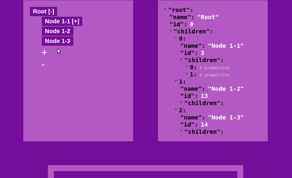

# vue-drag-tree

[](https://www.npmjs.com/package/vue-drag-tree)[](https://www.npmjs.com/package/vue-drag-tree)[](https://opensource.org/licenses/MIT)[](https://travis-ci.org/XadillaX/vue-drag-tree)[](https://david-dm.org/XadillaX/vue-drag-tree)

> 这是一个Vue2.x的树组件，并且允许你去拖拽节点进行两者位置的交换，当然，“交换”会反映到data数据里。

**特效**

- 双击节点把节点转换成一个 folder
- 可以拖拽不同的节点，甚至不同层面的
- 删除/填加节点

**[EN](README.md)**

### 预览

------



### 快速开始

------

**Install**

`npm install vue-drag-tree --save`

**Usage**

main.js

```vue
import Vue from 'vue'
import VueDragTree from 'vue-drag-tree'

Vue.component('vue-drag-tree', VueDragTree)
```

test.vue

```vue
<template>
	<vue-darg-tree :model='data'></vue-drag-tree>
</template>
<script>
export default{
  data(){
    return{
      data:{
        name: 'Root',
        id: 0,
        children: [
          {
            name: 'Node 1-1',
            id: 1
            children: [
              {
                name: 'Node 2-1',
                id: 2
              }
            ]
          },
          {
            name: 'Node 1-2',
            id: 3
          }
        ]
      }
    }
  }
}
<script>
```

**License**

------

[MIT](LICENSE)