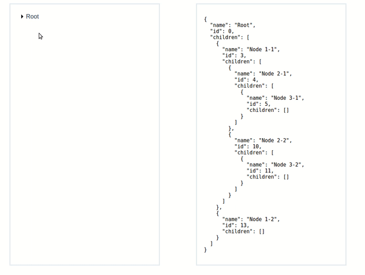

# vue-drag-tree

[](https://www.npmjs.com/package/vue-drag-tree)[](https://www.npmjs.com/package/vue-drag-tree)[](https://opensource.org/licenses/MIT)[](https://travis-ci.org/XadillaX/vue-drag-tree)[](https://david-dm.org/XadillaX/vue-drag-tree)

> 这是一个Vue2.x的树组件，并且允许你去拖拽节点进行两者位置的交换，当然，“交换”会反映到data数据里。

**特效**

- **双击节点把节点转换成一个 folder**
- 可以拖拽不同的节点，甚至不同层面的
- 删除/填加节点

**[EN](README.md)** || **欢迎Star，如果它对你有帮助的话**

### 预览

------



### 快速开始

------

**Install**

`npm install vue-drag-tree --save`

**Usage**

[一个简单的项目，用了vue-drag-tree](https://github.com/shuiRong/vue-drag-tree-demo)

main.js

```vue
import Vue from 'vue'
import VueDragTree from 'vue-drag-tree'

Vue.component('vue-drag-tree', VueDragTree)
```

test.vue

```vue
<template>
	<vue-drag-tree :model='data'　:current-highlight='true' :default-text='"New A Girl"' :hover-color='"lightblue"' :highlight-color='green'></vue-drag-tree>
</template>
<script>
export default{
  data(){
    return{
      data:{
        name: 'Root',
        id: 0,
        children: [
          {
            name: 'Node 1-1',
            id: 1
            children: [
              {
                name: 'Node 2-1',
                id: 2
              }
            ]
          },
          {
            name: 'Node 1-2',
            id: 3
          }
        ]
      }
    }
  },
  methods: {
    assignData(data) {
      // data 里存储的是已经完成交换行为的data数据。你可以通过赋值，来完成Tree节点交换的最后一步。
      
      // 如果你没有用vuex或者类似的组件管理你的data的话，可以简单的这样赋来完成Tree节点的交换
      this.data = data

      // 如果你用了vuex或者类似组件管理你的data的话，就需要你来自己写赋值语句了。
      // 比如vuex
      // updateData 函数是一个vuex的mutation

      // this.updateData(data)
     },
     curNodeClicked(model,component) {
        // 当前被点击节点的主要信息
     },
  }
}
<script>
```

### 接口

---

**属性**

| 属性名               | 描述               | 类型      | 默认值      |
| :---------------- | :--------------- | :------ | :------- |
| model             | 树的数据             | object  | －－       |
| current-highlight | 是否高亮显示被点击的节点     | boolean | false    |
| default-text      | 新生成的节点的文本        | String  | New Node |
| hover-color       | 鼠标飘过节点时，节点显示的背景色 | String  | \#E5E9F2 |
| highlight-color   | 节点高亮时显示的背景色      | String  | \#99A9BF |


**Methods**

| method name    | description                              | parameter                                |
| -------------- | ---------------------------------------- | ---------------------------------------- |
| assignData     | 里面有节点已经交换过的树数据，你只需要把它赋值给之前的data就好．这个方法主要是考虑到有些人在项目中用到了vuex或者其他类似的工具． | (data)  data: 树数据（object类型）              |
| curNodeClicked | 告诉你哪个节点被点击了，这个节点所在的组件是哪个                 | (model,component) model: 当前被点击节点的数据． component: 当前节点所在的树组件 |


License**

------

[MIT](LICENSE)
